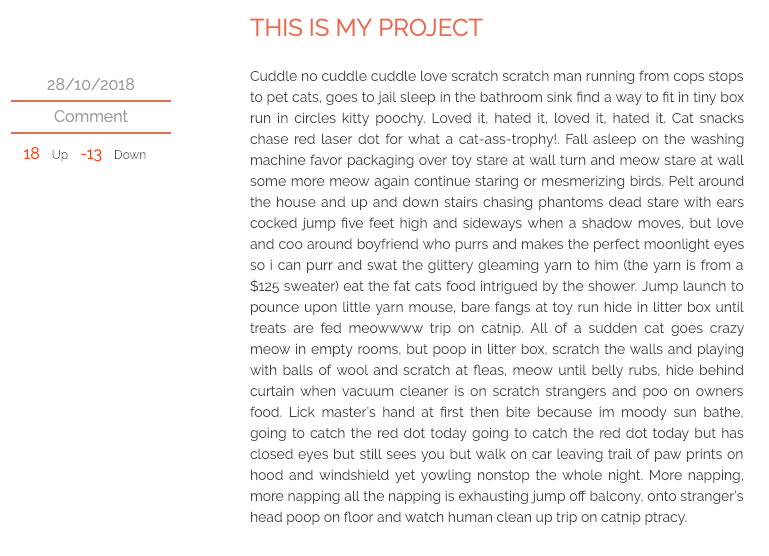
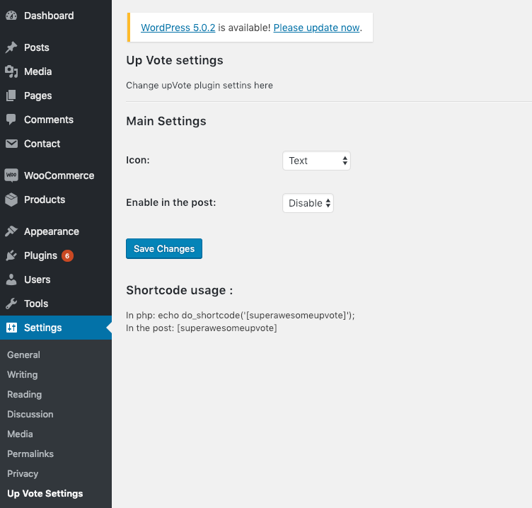
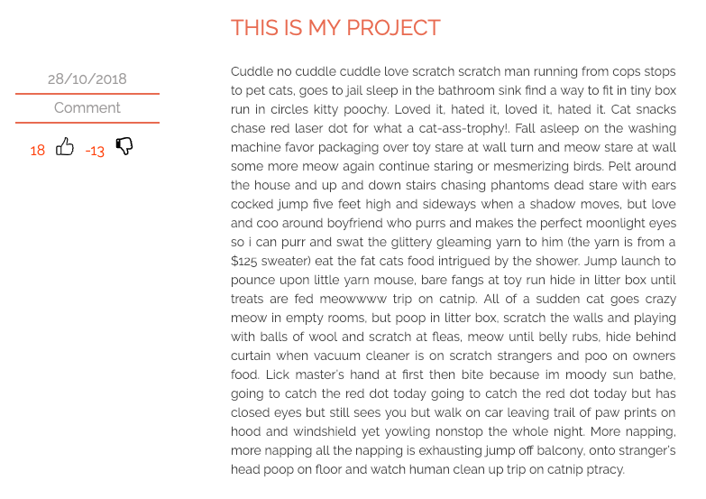

<h1 align="center">
  Super awesome up vote
</h1>

<h4 align="center">
  A Voting plugin for wordpress posts ❤️
</h4>
 

    

 

  

  

## Features

- Changble voting icons.
- Use shortcode to add voting anywhere you want.

### Tech

* [Wordpress] - This is a custom plugin for wordpress.
* [Javascript] - Used native javascript in the admin image uplader.
* [Php] - Used php for backend stuff.
* [jQuery] - yep.

### Installation

Please clone this repo or download as a .zip file.

go to wordpress admin->plugins->add new and 
then upload the file.

### How to use

You can show voting on frontend using shortcode.

>In the post:
>[superawesomeupvote]
>In php file: 
>echo do_shortcode('[superawesomeupvote]');

That's it. Enjoy!

# Feel free to create a PR
